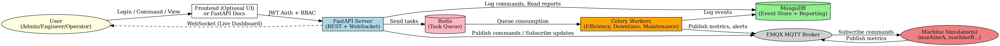
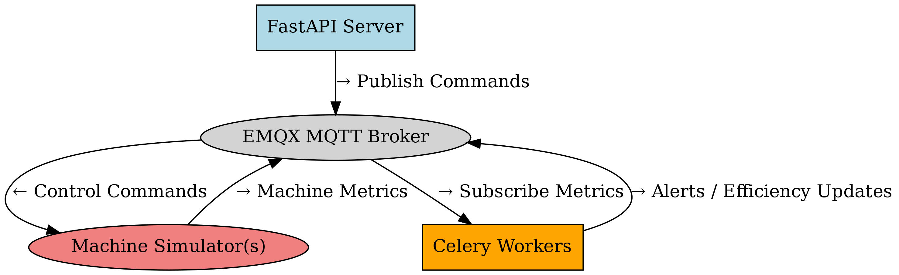
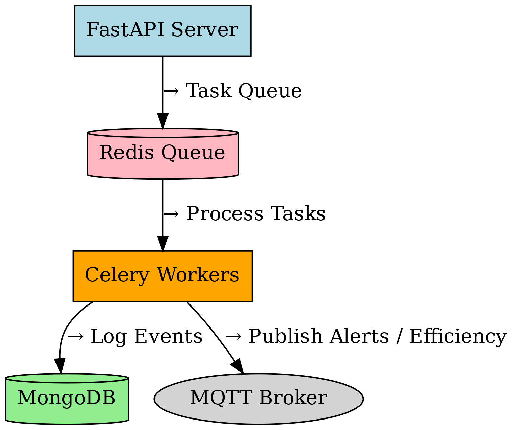
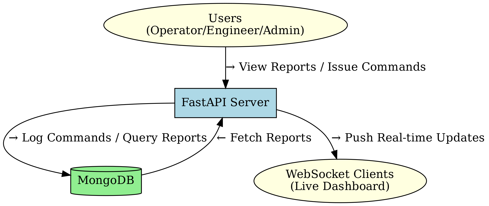

#  Smart Factory Orchestration Platform

A simulation-based smart factory orchestration system built using FastAPI, MQTT, Celery, Redis, and MongoDB. This system supports role-based control, real-time data streams, background processing, and predictive maintenance to serve as a foundation for Industry 4.0 solutions.

---

##  Project Summary

This platform simulates a real-time, secure, and intelligent factory monitoring system. It supports interaction between users and machine simulators via MQTT and provides REST and WebSocket interfaces for monitoring, control, and reporting.

---

##  Features

-  **Real-Time Production Monitoring**
-  **Alerting**
-  **Role-Based Access Control (RBAC)**
-  **Detailed Reporting APIs**
-  **WebSocket Dashboard for Live Updates**
-  **Comprehensive Event Logging (MongoDB)**
-  **Machine Simulator Script for Testing**

---

##  Tech Stack

| Component        | Technology               |
|------------------|--------------------------|
| API & UI         | FastAPI, WebSocket       |
| Messaging        | MQTT (EMQX Broker)       |
| Background Tasks | Celery + Redis           |
| Database         | MongoDB                  |
| Security         | JWT, RBAC |

---

##  Architecture Flow
### Smart Factory Orchestration Platform – Flow Diagram

  
   
  <em>Figure 1: Smart Factory Architecture Flow</em>

#### Explaination:

1. **User** logs in via FastAPI → receives JWT
2. **JWT** contains role & permissions → passed to API
3. **FastAPI Server** validates and routes:
   - Sends tasks to **Redis**
   - Streams updates via **WebSocket**
4. **Celery Workers** process tasks:
   - Calculate efficiency
   - Generate Report
5. **MongoDB** logs all events 
6. **Simulated Machines**:
   - Send metrics via MQTT
   

### MQTT Communication Flow

  
   
  <em>Figure 2: MQTT Communication Flow</em>

Shows how MQTT is used between simulators, FastAPI, and Celery.

### Celery Background Processing Flow

  
   
  <em>Figure 3: Celery Background Processing Flow</em>

Covers task queuing, Redis, worker processing and alert publishing.

### MongoDB + Reporting & WebSocket Flow

  
   
  <em>Figure 4: MongoDB + Reporting & WebSocket Flow</em>

Illustrates FastAPI interaction with MongoDB and real-time dashboard.

---

##  Authentication & Roles

- JWT-based authentication
- RBAC enforced at route level
- Roles:
  - **Admin**: Full access
  - **Engineer**: Limited to assigned lines
  - **Operator**: View-only for assigned machines

---

##  Sprint Goal (4 Days):

### Day 1: Project Setup & Authentication

- Set up project structure
- Initialize FastAPI app
- Implement JWT-based authentication and RBAC
- Design MongoDB user schema

### Day 2: Machine Simulation + MQTT Communication

- Build a Python-based machine simulator
- Enable MQTT message publishing & subscription
- Handle metrics like temperature, units produced
- Create MQTT topics and subscription patterns

### Day 3: Celery Integration + MongoDB Logging

- Implement Celery workers for:
- Efficiency tracking
- Downtime alerting
- Maintenance scheduling
- Log events to MongoDB

### Day 4: Dashboard + Reporting + WebSocket

- Expose endpoints for reports
- Implement WebSocket for real-time updates
- Role-based access for all APIs
